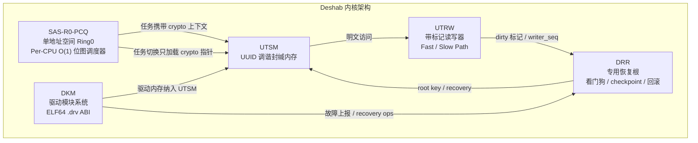

# Deshab-OS 架构设计文档

> 本文档描述 Deshab-OS 的系统整体架构、核心子系统设计与关键技术约束。
> 它是 [UTSM 模块设计](../CODE/UTSM/README.md)、[DKM 驱动系统](../CODE/DKM/README.md)、[DSK 主内核](../CODE/dsk/README) 等模块文档的上层索引与架构总览。

---

## 1. 项目定位

Deshab-OS 是一个**从零编写的独立 64 位操作系统**，不基于 Linux 或任何现有内核。项目目标是在 x86_64 long mode 上构建一个**极高权限、极高效率**的单地址空间 Ring0 内核，并配套完整的驱动加载、文件系统、网络、图形与首次启动体验。

| 属性 | 说明 |
|------|------|
| **目标架构** | x86_64 long mode（Higher Half，内核映射于 `0xffffffff80000000` 以上） |
| **权限模型** | 单地址空间 Ring0（SAS-R0），不追求传统多用户强隔离 |
| **引导器** | Limine（UEFI 优先，BIOS 兼容） |
| **主语言** | C11（freestanding）+ x86_64 汇编 |
| **工具链** | LLVM Clang + ld.lld（`-mcmodel=kernel -mno-sse -msoft-float`） |
| **构建/验证** | PowerShell `build.ps1` → `ISO/deshab.img`（GPT + FAT32 ESP）→ QEMU UEFI |

### 1.1 设计哲学

1. **极高权限与极高效率优先**——内核与驱动同处 Ring0，热路径必须保持 O(1)。
2. **内存默认封缄**——所有普通内存存密文，明文读写必须经过统一读写器（UTSM/UTRW）。
3. **恢复根独立**——DRR 拥有独立紧急内存池，普通 OOM 不阻断 recovery。
4. **驱动与内核解耦**——驱动通过稳定 ABI（`dkm_kernel_api`）调用内核服务，不直接依赖任意内核符号。
5. **先闭环再扩展**——每个子系统先用最小可验证链路跑通，再逐步深化数据路径。

---

## 2. 系统整体架构

### 2.1 启动链路

```text
UEFI 固件 / BIOS
  └─ Limine bootloader (BOOTX64.EFI)
       ├─ 读取 limine.conf
       ├─ 加载 boot():/boot/utsm.elf          ← 首阶段内核
       └─ 预加载 boot module：
            manifest.json / 14 个 *.drv / deshab.elf / test.fat32
                 │
                 ▼
       ┌─────────────────────────────────────┐
       │  UTSM 首阶段内核 (utsm.elf)          │
       │  早期启动 / 封缄内存 / DKM 驱动加载   │
       │  平台发现 / DSK 加载与跳转            │
       └───────────────┬─────────────────────┘
                       │ dsk_boot_context (RDI)
                       ▼
       ┌─────────────────────────────────────┐
       │  DSK 主内核 (deshab.elf)             │
       │  长期运行期 / 首次启动流程            │
       │  系统初始化调度 / 用户设置向导        │
       └─────────────────────────────────────┘
```

### 2.2 双阶段内核

Deshab 采用**双阶段内核**模型，职责严格分层：

| 阶段 | 产物 | 职责 | 不应做的事 |
|------|------|------|-----------|
| **UTSM** | `SYSTEM/boot/utsm.elf` | Long mode C 入口、serial、IDT、arena、DMA、UTSM init、DKM 首轮驱动加载、平台发现、DSK ELF 加载与跳转 | 不接管长期调度；不重复 Limine 原始解析 |
| **DSK** | `SYSTEM/system/deshab64/deshab.elf` | 接收 boot context、主内核生命周期、首次启动动画、调度 mouseInit/FirstInit/netman、块设备/VFS/网络运行期 | 不重复早期启动职责 |

UTSM 通过版本化的 `dsk_boot_context` 向 DSK 传递 HHDM、RSDP、framebuffer、boot modules、DKM API/driver table、UTSM/DRR 状态等信息，跳转约定：

```text
RDI = struct dsk_boot_context *
RSI = RDX = 0
中断状态 = disabled
paging  = UTSM 当前页表 (higher-half + HHDM)
```

### 2.3 UTSM 启动序列

源自 [`CODE/UTSM/kernel/main.c`](../CODE/UTSM/kernel/main.c)：

```text
kernel_main()
  → serial_init()              早期串口（不无限等待 ready 位）
  → idt_init()                 IDT 0–47 + PIC remap 到 0x20–0x2f
  → arena_init()               内核 arena（16MB）
  → dma_init()                 物理页 bitmap 分配器（Limine USABLE → bitmap）
  → net_init()                 netdev registry（8 槽固定表）
  → drr_stub_init()            DRR 占位
  → utsm_init()                封缄内存核心初始化
  → dkm_init() + dkm_fill_platform_info()
  → dsm_load_by_manifest()     按 manifest.json 分 4 stage 加载 14 个 .drv
  → utsm_selftest_run()        UTSM/PCKC/UTRW 自检
  → dsk_load_and_jump()        加载 deshab.elf（优先 FAT32 block provider，回退 Limine module）
```

---

## 3. 五大核心架构支柱

Deshab 的内核架构由五个紧密协作的子系统构成：



### 3.1 SAS-R0-PCQ — 单地址空间 Ring0 调度模型

```text
SAS-R0 = Single Address Space, Ring 0
PCQ    = Per-CPU O(1) 位图调度器
```

- **单地址空间**：内核与所有任务共享同一虚拟地址空间，无用户态/内核态隔离。
- **Ring0**：所有代码运行在最高特权级，不追求传统多用户强安全隔离。
- **Per-CPU 调度**：每个 CPU 维护独立 runqueue，调度热路径 O(1)。
- **任务结构**携带 UTSM 加密上下文（`process_uuid`、capability table、`hot_segment_hint`）。

任务状态机：`READY → RUNNING → BLOCKED / SLEEPING → RECOVERING / FAULTED → ZOMBIE`

> **设计约束**：调度切换路径中**禁止**扫描 capability table、计算 MAC、写 checkpoint 或重加密整段——这些会破坏 O(1) 目标。切换时只做：标记 PWC dirty flush、保存 hot_segment_hint、设置 PCKC.current_process_uuid、加载 next.crypto。

### 3.2 UTSM — UUID 调谐封缄内存

```text
UTSM = UUID-Tuned Sealed Memory
```

UTSM 是 Deshab 内存模型的核心：**所有普通内存可以被直接读取，但读到的是密文；真正有效的明文读写必须经过 UTRW 读写器。** UUID 作为进程和内存段的调谐因子，DRR 负责 root key 与恢复。

**核心规则**：

1. 数据区只存连续密文，UUID 不插入数据区（避免破坏 cache line / DMA / 批量复制）。
2. UUID 使用 128-bit 二进制格式（固定长度、cache 友好、适合 KDF/SIMD）。
3. 每个加密段有独立 DMP（段描述符元页）。
4. 每个任务有 `process_uuid` 和 capability table。
5. 加密粒度：**64B cache line**；Dirty 粒度：**4KB page**；MAC 粒度：**4KB page**。

**段内存布局**：

```text
+-------------------------------+
| DMP: Descriptor Meta Page     |   ← 热路径加速结构
+-------------------------------+
| Cipher Data Page 0            |
| Cipher Data Page 1            |   ← 连续密文
| ...                           |
+-------------------------------+
```

**加密方案**（原语待定型，见 [§10 开放设计点](#10-开放设计点)）：

```text
segment_key = KDF(DRR_root_key, process_uuid, segment_uuid, key_epoch)
tweak_seed  = hash(process_uuid, segment_uuid, key_epoch)
tweak       = hash(tweak_seed, line_index, key_epoch)
ciphertext  = plaintext  XOR stream(segment_key, tweak)
plaintext   = ciphertext XOR stream(segment_key, tweak)
```

**段状态机**：`FREE → ACTIVE → CHECKPOINTING / SEALED → RECOVERING → POISONED / DESTROYED`

完整设计见 [CODE/UTSM/README.md](../CODE/UTSM/README.md) 与 [RE/UTSM_设计架构.md](../RE/UTSM_设计架构.md)。

### 3.3 UTRW — 带标记读写器

UTRW 是访问 UTSM 明文的**唯一合法路径**，分三层：

| 层级 | 说明 |
|------|------|
| **Level 0 — Raw Access** | 直接读 `cipher_base`，得到密文（不可用明文） |
| **Level 1 — Fast Path** | capability O(1) 定位段 → PCKC 命中 → 无全局锁、无 trap 解密 |
| **Level 2 — Slow Path** | key miss / epoch mismatch / MAC fail / checkpoint 等异常处理 |

**Fast Path 定位**：`segment_slot + generation + epoch` 三元组直接定位并验证段。

**Fast Read 用 seqlock**：读 `writer_seq`（before），奇数则重试/slow；读完再读（after），`before != after` 重试。

**Fast Write**：`writer_seq++` 进奇数写态 → 按 64B line 加密 → 写密文 → 标 dirty bitmap → `writer_seq++` 回偶；强恢复段前后写 `WRITE_INTENT` / `WRITE_COMMIT` log。

**部分写**必须先解密旧 64B line，合并新明文后重新加密整条 line。

**Slow Path 错误策略**：

| 错误 | 处理 |
|------|------|
| `KEY_MISS` | 派生 key 写 PCKC，回 Fast Path |
| `EPOCH_EXPIRED` | 刷新 `cap.epoch` + `auth_tag`，清旧 key |
| `MAC_FAILED` | 标 suspicious page + 通知 DRR + 试 page rollback |
| `SEGMENT_POISONED` | 交 DRR 决定回滚 / 重建 / kill task |

### 3.4 DRR — 专用恢复根

```text
DRR = Dedicated Recovery Root
```

DRR 是独立于普通调度器的恢复根，负责看门狗、checkpoint、recovery log、A-B 回滚。

**核心约束**：

- DRR 必须拥有**独立 Emergency Pool**，普通 allocator 永远不能分配它；普通系统 OOM ≠ DRR OOM。
- recovery 路径**禁止依赖普通堆分配器**。
- Emergency Pool 耗尽时直接进入 system rollback。
- checkpoint 只处理 dirty shard / dirty page，**不扫描全内存**。

**Emergency Pool 分配算法**：`class freelist → 切 emergency pages → 不足则写 EXHAUSTED → system rollback`。

**Checkpoint 类型**：

| 类型 | 保存内容 |
|------|---------|
| Light Checkpoint | segment table、DMP、dirty shard summary、writer_seq、key_epoch、MAC root |
| Dirty Page Checkpoint | dirty page 密文副本、dirty page MAC、dirty shard、segment descriptor |
| Boot Checkpoint | 内核镜像 slot、UTSM root epoch、DRR boot status、启动阶段状态 |

**A/B 双槽元数据**：当前 active = A → 新 checkpoint 写 B → 写完 metadata + dirty index + MAC root + CRC → flush → 原子切换 active = B → 旧 A 保留为 fallback。恢复时优先读 active slot，CRC 错则 fallback 另一槽，两槽皆坏则 system rollback。

**回滚级别**：Page Rollback（单页）→ Segment Rollback（整段）→ System Rollback（控制面严重损坏，reboot 切 last_good_slot）。

**Dirty Shard 优化**：将大 dirty bitmap 拆成多个 shard，每个 shard 管理一段连续页范围并维护 `dirty_count`。checkpoint 跳过 `dirty_count == 0` 的 shard，复杂度从"扫描全 bitmap"优化为 `O(dirty_shards + dirty_pages)`。

### 3.5 DKM — 驱动模块系统

```text
DKM = Deshab Kernel Module
DSM = Driver Startup Manager
```

DKM 负责在内核启动时从 `SYSTEM/driver/manifest.json` 读取清单，按 stage 分阶段加载 ELF64 `.drv` 驱动模块。

**分阶段加载**：

| Stage | 名称 | 驱动 | 失败策略 |
|-------|------|------|---------|
| 0 | platform | timer / apic / acpi / pci | required 失败 → DRR recovery 或 panic |
| 1 | boot | console_fb / ahci / nvme / bootfs | required 失败 → DRR recovery |
| 2 | filesystem | vfs / fat32 / devfs | required 失败 → fallback bootfs / 只读 |
| 3 | optional | e1000 / virtio_net / ps2kbd | 失败只标记 FAILED，继续启动 |

**驱动 ABI**：每个 `.drv` 必须导出三个符号：

```c
// 描述符（magic=0x444B4D31 "DKM1", abi_version=1）
struct dkm_driver_desc *driver_desc;

// 入口：返回 0 成功，负数失败
int driver_init(const struct dkm_kernel_api *api, struct dkm_driver_handle *handle);
int driver_exit(struct dkm_driver_handle *handle);
```

**kernel_api 服务接口**——驱动默认通过 `dkm_kernel_api` 调用内核服务，不直接依赖内核符号：

```text
log / mem / utsm / irq / pci / dma / vfs / net / timer / drr
+ 平台直通：rsdp_address / fb_* / boot_modules_response / irq_register / hhdm_offset
+ block provider registry（驱动向 kernel_api.block 注册块设备）
```

**ELF Loader**：第一版支持 `R_X86_64_64 / RELATIVE / GLOB_DAT / JUMP_SLOT`（必须）、`PC32 / PLT32 / 32 / 32S`（建议）；禁止 TLS / IFUNC / lazy binding / 外部动态库 / 用户态 libc。

**加载状态机**：`DISCOVERED → QUEUED → DEP_WAIT → LOADING → ELF_CHECKED → MEMORY_ALLOCATED → RELOCATED → ABI_CHECKED → INITING → ACTIVE`，失败进入 `FAILED_*` 状态。

**boot module 查找**（stage0/stage1 不依赖 VFS）：path 在 boot module table → 直接内存加载；否则 VFS 可用则从 SYSTEM/path 加载；否则 `BOOT_MODULE_NOT_FOUND`。

完整设计见 [CODE/DKM/README.md](../CODE/DKM/README.md) 与 [RE/驱动模块ABI设计.md](../RE/驱动模块ABI设计.md)。

---

## 4. 辅助数据结构

### 4.1 DMP — 段描述符元页

DMP 是热路径加速结构，替代"UUID 数字位置表"，提供 O(1) 段定位、快速边界检查、tweak 生成、dirty bitmap / MAC table 定位。每个加密段有独立 DMP，含 `fast_base / fast_limit / fast_tweak_seed / fast_key_epoch` 等字段 + CRC 校验。

### 4.2 PCKC — 每 CPU 密钥缓存

```text
PCKC = Per-CPU Key Cache
```

每 CPU 一个 PCKC，默认 8 槽（高并发可扩 16），缓存 hot segment 的 key schedule。调度切换时只加载 `next.crypto` 指针和 `hot_segment_hint`，**不扫描 capability table、不刷新全部 key**。替换策略：LRU 或最冷 slot。

### 4.3 Capability — 段访问凭证

任务访问段使用 capability（非裸 UUID），热路径通过 `segment_slot + generation + epoch` 直接定位并验证。权限：`READ / WRITE / EXEC / SHARE / DMA`。任务默认 capability：`cap[0]=stack(RW) / cap[1]=heap(RW) / cap[2]=ipc(RWS,可选) / cap[3]=code(RX,可选)`。

---

## 5. 内存管理

### 5.1 当前实现

| 组件 | 实现 | 位置 |
|------|------|------|
| **内核 arena** | 16MB bump 分配区，用于 DKM 驱动加载 | `CODE/UTSM/mm/arena.c` |
| **DMA 分配器** | Limine USABLE → 物理页 bitmap，返回 `virt = hhdm + phys`，低 4G 钳位 | `CODE/UTSM/mm/dma.c` |
| **UTSM 段分配** | DMP + 密文数据区，纳入封缄内存 | `CODE/UTSM/core/segment.c` |

### 5.2 内存布局（全局区域）

```text
+--------------------------------------------------+
| Normal Encrypted Segment Region  普通加密段数据区  |
+--------------------------------------------------+
| DMP Pool                         段描述符元页池    |
+--------------------------------------------------+
| Segment Table                    全局段表          |
+--------------------------------------------------+
| PCKC Area                        每 CPU 密钥缓存区  |
+--------------------------------------------------+
| DRR Reserved Region              root key / checkpoint / recovery log |
+--------------------------------------------------+
```

### 5.3 关键约束

- **DMA 缓冲必须来自明确物理页分配**，不能用内核高半虚拟地址（BSS）反推物理地址——否则物理页与 CPU 映射不保证一致（e1000 DMA 卡死的根因）。
- **低 4G 约束**：32 位 BAR 设备（e1000 等）的 DMA 描述符/缓冲需落在低 4G。
- DATA/BSS 段使用 `PF_R|PF_W|PF_X`（SAS-R0 下驱动模块内存需可执行）。
- 未启用 FPU/SSE 前编译必须 `-mno-sse -mno-sse2 -mno-mmx -msoft-float`。

---

## 6. 驱动子系统现状

当前 14/14 DKM 驱动已完成 discovery 与加载闭环：

| Stage | 驱动 | 实现进度 |
|-------|------|---------|
| 0 | **timer** | PIT 校准，100ms busy-wait demo |
| 0 | **apic** | CPUID/MADT/LAPIC MMIO 只读探测，保留 PIC IRQ 路由 |
| 0 | **acpi** | RSDP → XSDT，ACPI 表枚举 |
| 0 | **pci** | PCI config space 扫描，设备枚举 |
| 1 | **console_fb** | Limine framebuffer，淡蓝背景 + 四色圆弧加载环（纯整数运算） |
| 1 | **ahci** | PCI AHCI 探测 + ABAR HHDM 映射 + SATA IDENTIFY/READ DMA + 注册 `ahci0` block provider |
| 1 | **nvme** | PCI NVMe 探测（BAR0 位于 4G 以上，等待高位 MMIO 映射） |
| 1 | **bootfs** | Limine boot module 内存文件系统 |
| 2 | **vfs** | 挂载 bootfs，文件查找/读取 |
| 2 | **fat32** | 只读 FAT32，优先 block provider，回退 boot module |
| 2 | **devfs** | `/dev/version` `/dev/platform` `/dev/fb0` `/dev/modules` `/dev/boot/` |
| 3 | **ps2kbd** | PS/2 IRQ1，scan code set 1 → ASCII |
| 3 | **e1000** | PCI 探测 + MAC + IRQ + **完整 RX/TX ring**（物理页 bitmap 根治 DMA） |
| 3 | **virtio_net** | PCI 探测 + modern virtio capability 枚举（未做 feature negotiation / virtqueue） |

---

## 7. 文件系统与块设备

### 7.1 块设备 provider registry

UTSM 通过 `kernel_api.block` 提供块设备注册与读取接口，解耦驱动与文件系统：AHCI 注册 `ahci0` 并实现 LBA read，FAT32 不需知道 AHCI 细节。block read 内部按最多 8 扇区分块（AHCI 当前单 PRDT entry）。

### 7.2 FAT32

- 只读 BPB/FAT/目录项解析，优先通过 block provider 读取，无设备或 BPB 无效时回退 boot module。
- DSK loader 内嵌 FAT32 解析器，优先 `kernel_api.block` + FAT32 读取 `deshab.elf`，无块设备时回退 Limine module。

### 7.3 devfs

暴露 `/dev/version`、`/dev/platform`、`/dev/fb0`、`/dev/modules`、`/dev/boot/`。

---

## 8. 网络子系统

### 8.1 netdev registry

早期固定 8 槽 netdev registry，O(1) 注册与查询。discovery-only 驱动也能注册 name/MAC/flags。

### 8.2 net API 边界

`kernel_api.net` 收窄为 `dkm_net_api*`：`register_netdev / submit_tx / poll_rx`（第一版只定边界）。

### 8.3 netman 网络管理器

`netman.elf` 由 DSK 调度，负责配置解析（`conf.conf` / root 8.3 `NETCONF.CNF`）、netdev 枚举、状态输出。在 e1000/virtio-net 仍缺完整数据路径时先做配置管理闭环。

---

## 9. 图形、字体与首次启动

### 9.1 字体系统

自研 **DBF（Deshab Bitmap Font）** 格式，8bpp 灰度：

| 文件 | 精度 | 覆盖 |
|------|------|------|
| `simhei_16.dbf` | 16×16 | GB2312 全部 6763 汉字 + ASCII 32–126 |
| `simhei_24.dbf` | 24×24 | 同上 |
| `simhei_32.dbf` | 32×32 | 同上 |

- 索引按 codepoint 升序，二分查找。
- 生成工具：`CODE/font/mkfont.py`（Python + Pillow）。
- FirstInit 使用 `render_embedded.py` 预渲染中文位图嵌入 ELF，避免运行时 TTF 解析。

### 9.2 首次启动流程

```text
DSK 启动
  → 旋转加载动画（双缓冲精灵、顺时针、comet-tail 渐变弧）
  → FAT32 读取 firstInit.txt
  → firstInit == 0（首次启动）：
       DSK → mouseInit.elf（PS/2 鼠标安全 stub）→ 返回 DSK
       DSK → FirstInit.elf
         → 环淡出 → "欢迎使用 Deshab" → 设置提示
         → 账户设置卡片（圆角矩形、白色输入框、18px 中文）
         → 键盘输入：计算机名 / 用户名 / 密码
         → SHA256 密码摘要 + XOR 加密配置缓冲
         → "设置完成"
  → firstInit != 0：正常启动（待实现）
```

| 组件 | 产物 | 职责 |
|------|------|------|
| **FirstInit** | `SYSTEM/system/user/use/FirstInit.elf` | 用户设置向导（计算机名/用户名/密码/网络配置） |
| **mouseInit** | `SYSTEM/system/deshab64/mouse/mouseInit.elf` | PS/2 鼠标安全初始化 stub |
| **netman** | `SYSTEM/system/deshab64/network/netman.elf` | 网络配置加载与 netdev 枚举 |

---

## 10. 开放设计点

以下为当前架构中**尚未定型**的设计决策，需在后续阶段明确：

1. **加密原语未指定**——KDF / hash / stream cipher / MAC 的具体算法（HKDF? BLAKE2? AES-CTR? Poly1305? CMAC?）三份设计文档均未确定。当前 UTSM selftest 使用占位 XOR stream，保留 64B line 接口以便后续替换。
2. **kernel_api 设计态 vs 实现态**——RE 设计文档定义全部 typed sub-struct 指针（`dkm_log_api*` 等 10 个），当前实现为 `const void *` 占位 + Limine 字段直通。需规划迁移路径。
3. **block 未作为独立子 API**——block 走 provider 注册（如 ahci 向 `kernel_api.block` 注册），而非 typed sub-struct。
4. **log API 签名分歧**——RE 设计为 printf 变参 `void (*info)(const char *fmt, ...)`，当前实现为 `void (*info)(const char *msg)`。
5. **v1 不追求**——完整 RAM 原地回滚、对恶意 Ring0 代码的强安全隔离、设备外部副作用回滚。设备恢复依赖文件系统 journal；网卡 TX 已发包不回滚。

---

## 11. 系统目录约定

```text
SYSTEM/                         # 打包为 IMG 后的系统根目录
├── boot/
│   ├── utsm.elf                # 首阶段内核（Limine 直接加载）
│   └── limine.conf             # 引导配置（预加载所有 boot module）
├── driver/
│   ├── manifest.json           # 驱动加载清单
│   ├── platform/  bus/  block/ # *.drv 驱动模块
│   ├── fs/  net/  input/  console/
│   └── test.fat32              # FAT32 驱动测试镜像
├── system/
│   ├── deshab64/
│   │   ├── deshab.elf          # DSK 主内核
│   │   ├── mouse/mouseInit.elf
│   │   └── network/netman.elf
│   ├── font/                   # simhei*.dbf 字体
│   └── user/use/               # FirstInit.elf + firstInit.txt
└── EFI/BOOT/BOOTX64.EFI        # UEFI 引导

CODE/                           # 源码
├── UTSM/                       # 首阶段内核源码
├── dsk/                        # DSK 主内核源码
├── DKM/                        # 14 个驱动源码
├── firstInit/  mouse/  netman/ # 用户空间初始化程序
└── font/                       # 字体工具

RE/                             # 研究与设计文档
├── UTSM_设计架构.md
├── UTSM_算法记录.md
└── 驱动模块ABI设计.md

docs/                           # 项目文档（本文档所在）
```

---

## 12. 相关文档索引

| 文档 | 内容 |
|------|------|
| [CODE/UTSM/README.md](../CODE/UTSM/README.md) | UTSM 封缄内存模块完整设计 |
| [CODE/DKM/README.md](../CODE/DKM/README.md) | DKM 驱动模块系统说明 |
| [CODE/dsk/README](../CODE/dsk/README) | DSK 主内核说明与 boot context |
| [RE/UTSM_设计架构.md](../RE/UTSM_设计架构.md) | UTSM 架构记录 |
| [RE/UTSM_算法记录.md](../RE/UTSM_算法记录.md) | UTSM 核心算法记录 |
| [RE/驱动模块ABI设计.md](../RE/驱动模块ABI设计.md) | DKM ABI 详细设计 |
| [LESSONS_LEARNED.md](../LESSONS_LEARNED.md) | 开发经验与教训记录 |
| [CLAUDE.md](../CLAUDE.md) | 项目上下文与当前状态 |
| [docs/BOOT_SEQUENCE.md](./BOOT_SEQUENCE.md) | 启动路线设计（B0-B4 五阶段） |
| [docs/ROADMAP.md](./ROADMAP.md) | 开发路线图 |
| [CONTRIBUTING.md](../CONTRIBUTING.md) | 贡献与协作规范 |
