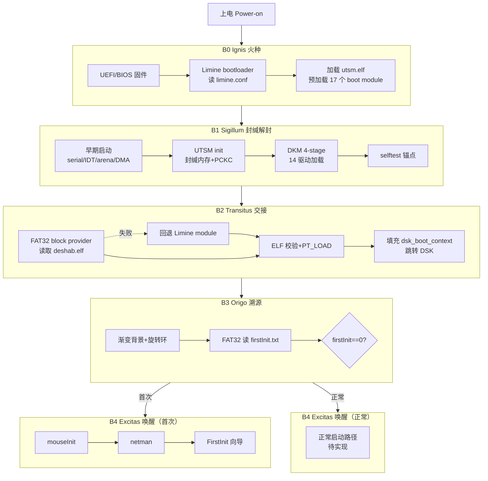
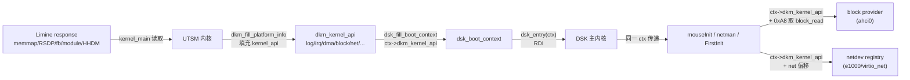

# Deshab 启动路线设计

> 本文档定义 Deshab-OS 从上电到用户可交互的完整启动序列。
> 它是 [架构设计文档](./ARCHITECTURE.md) 中启动链路的深度展开，基于真实源码实现。

---

## 0. 设计理念

Deshab 的启动不是一条简单的"引导→内核"直线，而是一个**带契约的分阶段唤醒过程**。每个阶段都有明确的入口条件、出口契约和失败语义，失败时可沿**启动回退链**降级到上一个稳定点，而非直接 panic。

### 0.1 原创命名体系

延续 Deshab 的工程化缩写风格（SAS-R0-PCQ / UTSM / DRR / DKM），启动序列命名为 **DBS（Deshab Boot Sequence）**，划分为五个阶段：

| 阶段 | 代号 | 名称 | 含义 | 产物 |
|------|------|------|------|------|
| B0 | **Ignis** | 火种 | 固件点燃，引导器接管 | `utsm.elf` 入内存 |
| B1 | **Sigillum** | 封缄解封 | UTSM 首阶段内核建立封缄内存与驱动底座 | 14 个 DKM 驱动 ACTIVE |
| B2 | **Transitus** | 交接 | UTSM 向 DSK 版本化传递控制权 | `dsk_boot_context` 就绪 |
| B3 | **Origo** | 溯源 | DSK 判定首次/正常启动，调度系统初始化器 | `firstInit` 标志判定 |
| B4 | **Excitas** | 唤醒 | 用户设置向导或正常启动路径 | 用户可交互 |

> 命名取自拉丁语，呼应 Deshab "封缄内存"（Sealed Memory）的意象：系统从封缄中逐层苏醒。

### 0.2 三个核心概念

**启动契约（Boot Contract）**——每个阶段 B(n) 对下一阶段 B(n+1) 做出明确承诺。契约包含：
- **Entry**：进入本阶段时 CPU/内存/设备必须处于什么状态
- **Exit**：离开本阶段时必须完成什么、向下一阶段传递什么
- **Fail**：本阶段失败时的降级策略（回退 / DRR 接管 / panic）

**启动锚点（Boot Anchor）**——每个阶段结束时的可验证检查点，输出稳定的串口日志标记。锚点是"已知稳定点"，回退只能退到锚点，不能退到阶段中间。例如 `[UTSM] SELFTEST PASS` 是 B1 的锚点。

**启动回退链（Boot Fallback Chain）**——失败时的降级路径，每级回退对应一个锚点：

```text
B2 DSK 块设备加载失败
  └─ 回退 B1 锚点：改用 Limine boot module 加载 deshab.elf
B1 某驱动 init 失败
  ├─ required 驱动 → DRR recovery 或 panic
  └─ optional 驱动 → 标记 FAILED，继续启动
B0 BCB 校验失败
  └─ 切换 last_good_slot（未来 DRR 实现）
```

---

## 1. 启动总览



---

## 2. B0 Ignis — 火种

### 2.1 契约

| 项 | 内容 |
|----|------|
| **Entry** | CPU 上电，执行固件（UEFI 优先），内存可用，PCI 设备已枚举 |
| **Exit** | `utsm.elf` 已加载到内存，boot module table 已构建，`limine.conf` 已解析，控制权交给 `_start` |
| **Fail** | 固件失败 → 硬件级复位；Limine 找不到 `utsm.elf` → 引导失败停在固件错误界面 |

### 2.2 执行细节

**固件阶段**：UEFI 固件加载 `SYSTEM/EFI/BOOT/BOOTX64.EFI`（即 Limine）。QEMU 场景需显式指定 UEFI 固件（`edk2-x86_64-code.fd` / `OVMF_CODE.fd`）。

**Limine 阶段**（源自 [`SYSTEM/boot/limine.conf`](../SYSTEM/boot/limine.conf)）：

```text
timeout: 0
serial: yes
verbose: yes

/UTSM boot
    protocol: limine
    kernel_path: boot():/boot/utsm.elf
    module_path: boot():/driver/manifest.json     # dkm:manifest
    module_path: boot():/driver/platform/timer.drv # 14 个 .drv
    ... (apic/acpi/pci/console_fb/ahci/nvme/bootfs/vfs/fat32/devfs/e1000/virtio_net/ps2kbd)
    module_path: boot():/system/deshab64/deshab.elf  # dsk:main
    module_path: boot():/driver/test.fat32            # dkm:test_fat32
```

Limine 从 FAT32 ESP 读取 `utsm.elf` 作为内核，并预加载 **17 个 boot module**：1 个 manifest + 14 个 `.drv` + 1 个 `deshab.elf` + 1 个 `test.fat32`。这些 module 通过 Limine module response 暴露给内核。

### 2.3 未来扩展（DRR 接入后）

B0 未来将引入 **BCB（Boot Control Block）** 校验：

```text
1. 读取 Boot Control Block
2. 校验 BCB CRC
3. 选择 active_slot
4. 若 active_slot 失败次数超限 → 切换 last_good_slot
5. 加载对应 slot 的 utsm.elf
6. 传入 memory map、BCB 地址、DRR reserved region 信息
```

当前 BCB 尚未实现，B0 直接加载单一 `utsm.elf`。

### 2.4 B0 锚点

无串口输出（serial 尚未初始化）。锚点为 Limine 成功跳转到 `_start`，由 B1 的 `[UTSM] boot` 间接验证。

---

## 3. B1 Sigillum — 封缄解封

### 3.1 契约

| 项 | 内容 |
|----|------|
| **Entry** | Long mode 已启用，`_start` 获得控制，RDI/RSI 含 Limine bootloader 信息，中断禁用 |
| **Exit** | UTSM 封缄内存初始化完成，14 个 DKM 驱动 ACTIVE，selftest 通过，平台发现完成 |
| **Fail** | required 驱动失败 → DRR recovery 或 panic；optional 驱动失败 → 标记 FAILED 继续 |

### 3.2 入口约定（源自 [`boot.S`](../CODE/UTSM/arch/x86_64/boot.S)）

```asm
_start:
    cli          # 进入 C 前必须关中断（IDT 未建）
    cld          # 清方向标志（避免 rep movs 反向）
    lea kernel_stack_top(%rip), %rsp
    andq $-16, %rsp   # 16 字节栈对齐
    call kernel_main
```

**强制约束**：
1. `cli` / `cld` 必须在最前——未建 IDT 前被中断或方向标志异常会导致三重故障。
2. 早期设置 `IA32_GS_BASE`——防止栈保护 prologue 访问 GS 段时页错误（真机三重故障的根因之一）。
3. 未启用 FPU/SSE 前编译必须 `-mno-sse -mno-sse2 -mno-mmx -msoft-float`——Clang 在 freestanding 下也可能生成 `xorps/movups`。

### 3.3 执行序列（源自 [`kernel/main.c`](../CODE/UTSM/kernel/main.c)）

```text
kernel_main()
  ① serial_init()         早期串口（不无限等待 ready 位，超时降级）
  ② idt_init()            IDT 0–47 stub + PIC remap 到 0x20–0x2f
  ③ arena_init()          内核 arena（16MB bump 分配区）
  ④ dma_init()            物理页 bitmap（Limine USABLE → bitmap，低 4G 钳位）
  ⑤ net_init()            netdev registry（8 槽固定表）
  ⑥ drr_stub_init()       DRR 占位（真实 DRR 待实现）
  ⑦ utsm_init()           封缄内存：segment table + PCKC
  ⑧ dkm_init() + dkm_fill_platform_info()
  ⑨ dsm_load_by_manifest()  按 manifest.json 分 4 stage 加载 14 个 .drv
  ⑩ utsm_selftest_run()     UTSM/PCKC/UTRW 自检
  ⑪ dsk_load_and_jump()     → 进入 B2
```

### 3.4 DKM 分阶段加载（源自 [`manifest.json`](../SYSTEM/driver/manifest.json)）

| Stage | 名称 | 驱动 | 失败策略 |
|-------|------|------|---------|
| 0 | platform | timer → apic → acpi → pci | required 失败 → DRR recovery / panic |
| 1 | boot | console_fb / ahci / nvme / bootfs | required 失败 → DRR recovery |
| 2 | filesystem | vfs → fat32 / devfs | required 失败 → fallback bootfs / 只读 |
| 3 | optional | e1000 / virtio_net / ps2kbd | 失败只标记 FAILED，继续启动 |

**加载状态机**：`DISCOVERED → QUEUED → DEP_WAIT → LOADING → ELF_CHECKED → MEMORY_ALLOCATED → RELOCATED → ABI_CHECKED → INITING → ACTIVE`

**ELF 重定位**：必须 `R_X86_64_64/RELATIVE/GLOB_DAT/JUMP_SLOT`，建议 `PC32/PLT32/32/32S`，禁止 TLS/IFUNC/lazy binding。

**boot module 查找**（stage0/stage1 不依赖 VFS）：path 在 boot module table → 内存加载；否则 VFS 可用则从 SYSTEM/path 加载；否则 `BOOT_MODULE_NOT_FOUND`。

### 3.5 kernel_api 平台直通

B1 完成后，`dkm_kernel_api` 已暴露：`log / rsdp_address / fb_* / boot_modules_response / irq_register / hhdm_offset / dma.alloc_pages / block / net`。

### 3.6 B1 锚点

```text
[UTSM] boot
... (各初始化阶段日志)
[UTSM] SELFTEST PASS          ← B1 锚点（稳定点 1）
```

**锚点语义**：到达此日志表示封缄内存、DKM 驱动、平台发现全部就绪，可安全进入 B2。若未到达此锚点，DRR（未来）应能从 B0 重新引导。

---

## 4. B2 Transitus — 交接

### 4.1 契约

| 项 | 内容 |
|----|------|
| **Entry** | B1 锚点达成，`dkm_kernel_api` 就绪，boot module response 可用 |
| **Exit** | `deshab.elf` 已加载并重定位，`dsk_boot_context` 已填充，控制权交给 `dsk_entry(ctx)` |
| **Fail** | FAT32 block provider 失败 → 回退 Limine module；两者皆失败 → panic |

### 4.2 两阶段 DSK 加载（源自 [`dsk_loader.c`](../CODE/UTSM/kernel/dsk_loader.c)）

```text
dsk_load_and_jump()
  ① 优先：FAT32 block provider
       kernel_api.block.read(0, lba, count, buf)
       → 解析 BPB → 遍历 root cluster → 找 "DESHAB  ELF"
       → 沿 FAT 链读取文件到 arena
  ② 回退：Limine boot module
       遍历 module response 找 path=="/system/deshab64/deshab.elf"
       或 cmdline=="dsk:main"
  ③ ELF 校验：ELFCLASS64 / ELFDATA2LSB / EM_X86_64 / ET_DYN|ET_EXEC
  ④ PT_LOAD 加载：计算 min/max vaddr → arena 分配 → 清零 → 复制 filesz
  ⑤ 填充 dsk_boot_context
  ⑥ 跳转 entry(ctx)
```

**关键约束**：
- `data_start_sec = rsvd + fat_count * spf`——漏掉第二份 FAT 会导致 root cluster 错位。
- arena 容量需足够（已从 4MB 扩到 16MB，后续应迁移到物理页分配器）。
- 批量读 256 扇区稳定，单扇区连续读偶尔超时——DSK loader 全部用 cluster 级批量读取。

### 4.3 dsk_boot_context 版本化传递

源自 [`dsk.h`](../CODE/UTSM/include/utsm/dsk.h)，magic = `0x44534B31424F4F54`（"DSK1BOOT"）：

```c
struct dsk_boot_context {
    u64 magic;              // DSK_BOOT_MAGIC，DSK 入口必须校验
    u32 abi_version;        // DSK_BOOT_ABI_VERSION = 1
    u32 size;
    u64 flags;              // FROM_UTSM | DKM_READY | FAT32_PATH
    u64 hhdm_offset;        // physical → virtual direct map
    u64 rsdp_address;       // ACPI RSDP
    u64 framebuffer_address/width/height/pitch/bpp;
    u64 boot_modules_response;
    u64 dkm_kernel_api;     // DSK 通过此指针访问所有内核服务
    u64 dkm_driver_table / driver_count;
    u64 utsm_state / drr_state;        // 当前为占位
    u64 memory_map / count / entry_size;
    u64 kernel_stack_top;
    u64 reserved[8];        // 未来扩展（只能追加，不能插入）
};
```

**跳转约定**：

```text
RDI = dsk_boot_context *
RSI = RDX = 0
中断状态 = disabled
paging  = UTSM 当前页表（higher-half + HHDM）
```

> **ABI 约束**：`dsk_boot_context` 字段只能追加到 `reserved` 区，不能在中间插入，否则 DSK 入口偏移错位。DSK 通过硬偏移读取 `block_read`（`api + 0xA8`），偏移错误会导致 NULL 解引用。

### 4.4 B2 锚点

```text
[UTSM] loading DSK
[UTSM] DSK loaded from FAT32 block provider    ← 或 "trying Limine module"
[UTSM] DSK image base=0x...
[UTSM] DSK entry=0x...
[UTSM] jumping to DSK
[DSK] boot                                     ← B2 锚点（稳定点 2）
[DSK] context ok
```

**锚点语义**：`[DSK] context ok` 表示 magic 校验通过，DSK 已接管控制权。若 `[DSK] bad context` 则 magic 不匹配，DSK 直接 halt。

---

## 5. B3 Origo — 溯源

### 5.1 契约

| 项 | 内容 |
|----|------|
| **Entry** | B2 锚点达成，`dsk_boot_context` 校验通过，framebuffer 可用 |
| **Exit** | `firstInit` 标志已判定，系统初始化器已调度（首次启动时） |
| **Fail** | 无 block device → 跳过 firstInit 检查，进入正常启动；FAT32 读取失败 → 视为首次启动 |

### 5.2 执行序列（源自 [`dsk/main.c`](../CODE/dsk/main.c)）

```text
dsk_entry(ctx)
  ① cli  # 禁用 IRQ——ps2kbd/IRQ1 和 mouse/IRQ12 handler 在 spinner 期间会崩
  ② 校验 ctx->magic == DSK_BOOT_MAGIC，失败则 halt
  ③ 从 ctx->dkm_kernel_api + 0xA8 取 block_read 函数指针
  ④ 绘制渐变背景（BG_TOP 淡蓝 → BG_BOTTOM 深紫，按 y 插值）
  ⑤ 旋转加载环动画循环：
       - 双缓冲精灵（128×128 离屏 sprite）
       - 四色圆弧（顺时针旋转，comet-tail 渐变）
       - 每帧按行重算 sprite 背景以匹配渐变
       - base -= 2（顺时针），frame++
  ⑥ frame >= 100 后触发首次启动检测：
       - 有 block_read → FAT32 读 "FIRSTINTXT"
       - firstInit == '0' → 首次启动
       - firstInit != '0' 或文件不存在 → 正常启动
  ⑦ 首次启动时调度系统初始化器（见 §6）
  ⑧ frame > 150 后跳转 FirstInit.elf
```

### 5.3 视觉体验设计

**渐变背景**：`BG_TOP = 0xFFC8E0F0`（淡蓝）→ `BG_BOTTOM = 0xFF49306F`（深紫），按屏幕 y 坐标线性插值。FirstInit 复用相同背景语义，保证转场连续。

**旋转加载环**：
- 中心 `(cx, cy) = (fb_w/2, fb_h/2)`，半径 `r=48`，厚度 `thk=4`。
- 四色弧：`arcs = {0xFF4488CC, 0xFF2266AA, 0xFF66AAEE, 0xFF88CCFF}`，每段 90°，宽 82°。
- comet-tail：弧两端 6° 范围内 alpha 渐变（fade 0→255→0），形成拖尾。
- 内圆高光：`r-8` 范围内用背景色与白色 `(0xD0,0xF0,0xFF)` 混合，营造光晕。
- 纯整数运算（无浮点依赖），`isqrt_int` 用牛顿迭代。

**帧率控制**：`for(volatile u32 d=0; d<72000; d++) __asm__("pause")`——约 60fps（QEMU 下）。

### 5.4 B3 锚点

```text
[DSK] block_read ptr=0x...
[DSK] entering spinner loop
[DSK] checking firstInit...
[DSK] fat32 reading 256 sectors from LBA 0
[DSK] firstInit=0                    ← 首次启动判定
[DSK] first init detected; running system initializers
```

---

## 6. 系统初始化器调度协议

### 6.1 设计原则

DSK **独占系统组件初始化职责**。FirstInit 只负责用户级设置（计算机名/用户名/密码），不接管系统初始化。这一边界避免"用户向导"与"系统初始化"逻辑耦合。

### 6.2 调度顺序（首次启动）

```text
DSK (firstInit == 0)
  → ① mouseInit.elf   系统输入初始化（PS/2 鼠标安全 stub）
       DSK 调用 → mouseInit 执行 → 返回 DSK
  → ② netman.elf      网络管理器（配置加载 + netdev 枚举 + DHCP）
       DSK 调用 → netman 执行 → 返回 DSK
  → ③ FirstInit.elf   用户设置向导
       DSK 调用 → FirstInit 接管 UI → 不返回（halt）
```

### 6.3 初始化器 ELF 加载

DSK 用内嵌 FAT32 解析器 + PIE ELF loader 加载每个初始化器：

```text
fat32_read_root_file("MOUSE   ELF", &data, &size)
  → dsk_load_elf(data, size, &entry)
    → 校验 ELF64 / EM_X86_64
    → PT_LOAD 复制到静态 image buffer
    → PT_DYNAMIC → DT_RELA/DT_RELASZ → R_X86_64_RELATIVE 重定位
      (*slot = load_bias + addend)
    → entry = image + (e_entry - min_vaddr)
  → entry(ctx)  # 传入同一 dsk_boot_context
```

**关键约束**：
- PIE ELF 必须处理 `R_X86_64_RELATIVE`——否则解引用全局指针/数组会 page fault。
- 指针数组改用栈上 `char[]` 逐字节赋值——避免 UTSM loader 不处理 `.rela.dyn` 的问题。
- ELF 文件大小不能超过静态缓冲区（`g_fdata[262144]` = 256KB），`dsk_load_elf` 必须校验 `found_size <= sizeof(g_fdata)`。
- 8.3 文件名必须用栈上字符数组构造，避免 PIE 重定位（`char name[12]; name[0]='F'; ...`）。

### 6.4 各初始化器职责

| 初始化器 | 产物 | 当前状态 | 职责 |
|---------|------|---------|------|
| **mouseInit** | `mouse/mouseInit.elf` | 安全 stub | 只读 PS/2 状态，不写控制器（避免 QEMU 早期阶段阻塞） |
| **netman** | `network/netman.elf` | 配置闭环 | 读 `conf.conf`/`NETCONF.CNF`，枚举 netdev，e1000 最小 DHCP |
| **FirstInit** | `user/use/FirstInit.elf` | UI + 输入 | 环淡出 → "欢迎使用 Deshab" → 账户设置卡片 → 键盘输入 → SHA256 密码 |

---

## 7. B4 Excitas — 唤醒

### 7.1 首次启动路径

```text
FirstInit.elf (dsk_entry → entry(ctx))
  ① 接收 dsk_boot_context，复用 framebuffer
  ② 加载环淡出动画（~1秒渐变）
  ③ 屏幕中央："欢迎使用 Deshab"（预渲染 24px 中文位图，180×30）
  ④ 等待 5 秒
  ⑤ 渐隐切换为："接下来让我们来引导你设置你的系统"
  ⑥ 账户设置卡片：
       - 圆角矩形（draw_card，isqrt_int 边界检查）
       - 白色输入框（INPUT_BG = 0xFFF0F5FA）
       - 18px 中文（text_bitmaps.c 预渲染嵌入 ELF）
  ⑦ PS/2 键盘轮询输入：计算机名 → 用户名 → 密码
  ⑧ SHA256 密码摘要 + XOR 加密配置缓冲（user.conf 格式）
  ⑨ "设置完成"提示
  ⑩ for(;;) hlt  # 当前不返回，待写盘后跳转正常启动
```

**字体方案**：
- 预渲染中文位图：`CODE/font/render_embedded.py` 用 Pillow 从 `simhei.ttf` 渲染指定字符串为 8bpp 灰度 C 数组，嵌入 ELF，避免运行时 TTF 解析。
- 运行时字体：DBF 格式（`simhei_16/24/32.dbf`），GB2312 全部 6763 汉字 + ASCII，索引按 codepoint 升序二分查找。

### 7.2 正常启动路径（待实现）

```text
firstInit != 0（或文件不存在）
  → B3 检测到非首次启动
  → 跳过系统初始化器调度
  → frame > 800 后 break 退出 spinner
  → [DSK] SELFTEST PASS
  → for(;;) hlt
```

当前正常启动路径仅 halt。未来将进入：
- 桌面环境 / Shell
- 用户登录验证（读取 user.conf，校验密码）
- 后台服务启动

### 7.3 首次→正常的转换条件

首次启动完成后，需写 `firstInit.txt = '1'` 以标记已完成。当前**写盘待实现**（依赖 `dkm_block_api.write` + AHCI WRITE DMA + FAT32 文件覆写，见 [路线图](./ROADMAP.md) Phase 5）。

### 7.4 B4 锚点

```text
[DSK] jumping to mouseInit
[mouse] init done
[DSK] mouseInit returned
[DSK] jumping to netman
[netman] ...
[DSK] netman returned
[DSK] loading FirstInit.elf
[DSK] FirstInit.elf loaded
[DSK] jumping to FirstInit        ← B4 锚点（稳定点 3）
```

---

## 8. 启动错误恢复

### 8.1 当前回退链

| 失败点 | 回退策略 | 日志 |
|--------|---------|------|
| B2 FAT32 block provider 不可用 | 回退 Limine module | `[UTSM] FAT32 block path unavailable; trying Limine module` |
| B2 DSK module 两路径都找不到 | panic | `[UTSM] DSK module not found (neither FAT32 nor Limine)` |
| B2 ELF 校验失败 | panic | `[UTSM] DSK ELF rejected` |
| B3 无 block device | 跳过 firstInit，正常启动 | `[DSK] no block device, skipping firstInit` |
| B3 firstInit.txt 不存在 | 视为首次启动 | `[DSK] firstInit.txt not found` |
| B3 FirstInit.elf 加载失败 | 继续正常启动 | `[DSK] firstInit not found, continuing normal boot` |
| B4 mouseInit.elf 加载失败 | 跳过，继续 netman | （日志无，静默跳过） |
| B1 required 驱动失败 | DRR recovery / panic | （DKM 标记 FAILED_REQUIRED） |
| B1 optional 驱动失败 | 标记 FAILED，继续 | （DKM 标记 FAILED_*） |

### 8.2 DRR 接管路径（未来）

DRR（专用恢复根）实现后，启动错误恢复将升级为三级：

```text
Page Rollback    单页损坏，从 checkpoint slot 恢复密文页
Segment Rollback 整段损坏，恢复 segment desc / DMP / key_epoch
System Rollback  控制面严重损坏，写 crash reason → reboot → bootloader 切 last_good_slot
```

DRR Emergency Pool 独立于普通 allocator，recovery 路径禁止依赖普通堆。详见 [架构设计文档 §3.4](./ARCHITECTURE.md#34-drr--专用恢复根)。

### 8.3 真机调试特殊处理

QEMU 不严格检查 NX，真机 Limine page table 会强制 NX。以下问题只在真机暴露，需特殊处理：

- `kernel_panic` 应直接通过 COM1 串口输出，**不依赖 console/heap**。
- 添加分步 `screen_info()` 便于真机调试。
- 早期 `IA32_GS_BASE` 必须设置，否则栈保护 prologue 页错误。

---

## 9. 启动状态传递链

启动过程中，系统状态通过三级指针链传递给 DSK 及其初始化器：



**关键约束**：
- DSK 及所有初始化器共享同一个 `dsk_boot_context`，通过它访问所有内核服务。
- `block_read` 通过硬偏移 `api + 0xA8` 读取——偏移错误会导致 NULL 解引用（曾因误用 `0x60` 导致 `g_block_read` 永远为 NULL）。
- 所有初始化器都是 PIE ELF，DSK loader 必须处理 `R_X86_64_RELATIVE`。

---

## 10. 启动阶段与架构映射

| 启动阶段 | 架构子系统 | 涉及源码 |
|---------|-----------|---------|
| B0 Ignis | Limine bootloader | `SYSTEM/EFI/BOOT/` `SYSTEM/boot/limine.conf` |
| B1 Sigillum | UTSM + DKM + DMA + IDT | `CODE/UTSM/` `CODE/DKM/` |
| B2 Transitus | DSK loader + FAT32 + block provider | `CODE/UTSM/kernel/dsk_loader.c` `CODE/UTSM/kernel/block.c` |
| B3 Origo | DSK 主内核 + FAT32 内嵌解析 | `CODE/dsk/main.c` |
| B4 Excitas | FirstInit + mouseInit + netman + 字体 | `CODE/firstInit/` `CODE/mouse/` `CODE/netman/` `CODE/font/` |

---

## 11. 启动验证标准

### 11.1 最小启动验证（QEMU 默认场景）

```text
[UTSM] boot                          ← B1 开始
[UTSM] SELFTEST PASS                 ← B1 锚点
[UTSM] loading DSK
[UTSM] DSK loaded from FAT32 block provider   ← 或 Limine module
[UTSM] jumping to DSK
[DSK] boot                           ← B2 锚点
[DSK] context ok
[DSK] SELFTEST PASS                  ← B3 正常启动锚点
```

### 11.2 首次启动完整验证（带 SATA FAT32 测试盘）

```text
[UTSM] boot
[UTSM] SELFTEST PASS
[UTSM] loading DSK
[DSK] boot
[DSK] context ok
[DSK] block_read ptr=0x...
[DSK] entering spinner loop
[DSK] checking firstInit...
[DSK] fat32 reading 256 sectors from LBA 0
[DSK] firstInit=0
[DSK] first init detected; running system initializers
[DSK] jumping to mouseInit
[mouse] init done
[DSK] mouseInit returned
[DSK] jumping to netman
[DSK] netman returned
[DSK] loading FirstInit.elf
[DSK] FirstInit.elf loaded
[DSK] jumping to FirstInit           ← B4 锚点
（屏幕显示：渐变背景 → 旋转环 → "欢迎使用 Deshab" → 账户设置卡片）
```

### 11.3 设备测试场景

| 场景 | QEMU 参数 | 验证锚点 |
|------|----------|---------|
| SATA 块设备 | 临时 SATA FAT32 测试盘 | `block_read ptr` 非 NULL，FAT32 读取成功 |
| NVMe | `-device nvme` | 探测 `1b36:0010`（register 读取依赖高位 MMIO） |
| e1000 网络 | `-device e1000e` | netdev `tx=ready rx=ready` |
| virtio-net | `-netdev user` + `-device virtio-net-pci` | 探测 `1af4:1001` |

---

## 12. 相关文档

| 文档 | 内容 |
|------|------|
| [架构设计文档](./ARCHITECTURE.md) | 五大核心子系统、内存模型、驱动系统 |
| [开发路线图](./ROADMAP.md) | 分阶段开发路线（Phase 0-9） |
| [DSK 主内核说明](../CODE/dsk/README) | DSK boot context 与加载要求 |
| [UTSM 模块设计](../CODE/UTSM/README.md) | 封缄内存与启动流程 §16 |
| [DKM 驱动系统](../CODE/DKM/README.md) | 驱动分阶段加载与状态机 |
| [CLAUDE.md](../CLAUDE.md) | 项目当前状态与下一阶段路线 |
