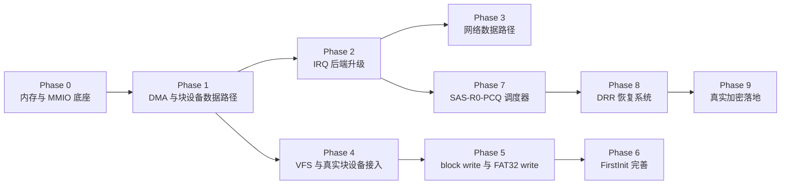

# Deshab-OS 开发路线图

> 本文档基于项目当前实现状态与各模块规划，给出分阶段开发路线。
> 状态标记：✅ 已完成 · 🔶 部分完成 · ⬜ 待实现

---

## 当前状态总览

Deshab-OS 已完成**可启动的实验内核**闭环：

```text
Limine → utsm.elf → DKM 14 驱动加载 → DSK (deshab.elf)
  → 旋转加载动画 → 首次启动检测
  → firstInit=0: mouseInit → FirstInit 用户设置向导（中文 UI / SHA256 密码）
  → firstInit≠0: 正常启动（待实现）
```

| 子系统 | 状态 | 说明 |
|--------|------|------|
| 早期启动（serial/IDT/PIC） | ✅ | IDT 0–47，PIC remap 0x20–0x2f |
| UTSM 封缄内存 | 🔶 | selftest 闭环，占位 XOR stream，真实加密待实现 |
| DKM 驱动加载 | ✅ | 14/14 驱动 discovery + 加载闭环 |
| DMA 分配器 | ✅ | Limine USABLE → 物理页 bitmap，低 4G 钳位 |
| AHCI 块设备 | 🔶 | IDENTIFY/READ DMA + block provider，无 write |
| NVMe | 🔶 | PCI discovery only，BAR0 在 4G 以上待映射 |
| FAT32 | 🔶 | 只读，优先 block provider 回退 boot module |
| e1000 网络 | 🔶 | 完整 RX/TX ring，无协议栈 |
| virtio_net | 🔶 | PCI discovery + capability 枚举，无 virtqueue |
| 字体系统 | ✅ | DBF 格式 16/24/32px，GB2312 全覆盖 |
| FirstInit | 🔶 | 中文 UI + 键盘输入 + SHA256 密码，写盘待实现 |
| SAS-R0-PCQ 调度器 | ⬜ | 设计完成，未实现 |
| DRR 恢复根 | ⬜ | stub 占位，未实现 |

---

## 路线图总览



**优先级原则**（源自 [DSK README](../CODE/dsk/README) §7）：

> 先让 UTSM 能加载并跳到 DSK → 再补内存/MMIO/DMA → 再做块设备真实读取 → 再迁移文件系统和网络数据路径 → 最后进入调度器和恢复系统深化。

---

## Phase 0 — 内存与 MMIO 底座

**目标**：建立物理页分配器、页表映射接口、高位 PCI MMIO 映射能力，解决 NVMe 4G 以上 BAR 和后续 DMA 映射问题。

| 任务 | 状态 | 验收标准 |
|------|------|---------|
| 物理页 bitmap 分配器 | ✅ | Limine USABLE → bitmap，已根治 e1000 DMA |
| 页表映射接口（map/unmap） | ⬜ | 提供 `mmio_map(phys, size, flags)` 通用接口 |
| 高位 PCI MMIO 映射（4G 以上 BAR） | ⬜ | NVMe BAR0 可安全读取 register |
| 替换 arena 为真实页分配 | ⬜ | DKM 驱动加载使用物理页分配器，移除 16MB arena 上限 |

**依赖**：无（基础设施）

**风险**：页表操作需在关中断下小心进行；高位 MMIO 映射需建立独立页表项，避免破坏 HHDM。

---

## Phase 1 — DMA 与块设备数据路径

**目标**：建立 contiguous DMA buffer、cache/屏障约定、PRDT/队列内存管理，推进 AHCI/NVMe 真实读写。

| 任务 | 状态 | 验收标准 |
|------|------|---------|
| DMA buffer 统一接口（alloc/sync_for_device/sync_for_cpu） | 🔶 | `dkm_dma_api` 已定义，cache 屏障约定待完善 |
| AHCI IDENTIFY/READ | ✅ | SATA 盘可读取 LBA0 |
| AHCI 多扇区批量 read 稳定化 | 🔶 | 256 扇区批量读成功，单扇区偶发超时待收敛 |
| AHCI block provider 注册 | ✅ | `ahci0` 注册到 `kernel_api.block` |
| NVMe admin queue / identify | ⬜ | 依赖 Phase 0 高位 MMIO |
| NVMe block provider | ⬜ | 注册 `nvme0`，支持 READ |

**依赖**：Phase 0

**风险**：AHCI command header 布局须严格按规范；不对 ATAPI/空端口发 ATA IDENTIFY。

---

## Phase 2 — IRQ 后端升级

**目标**：在 PIC fallback 稳定基础上扩展 IDT/vector allocator/APIC EOI/IOAPIC redirection，逐步迁移设备 IRQ，最后接入 MSI/MSI-X。

| 任务 | 状态 | 验收标准 |
|------|------|---------|
| IDT 扩展到 256 vectors | 🔶 | 当前 0–47 stub |
| Vector allocator | ⬜ | 动态分配中断向量 |
| APIC EOI 后端 | ⬜ | 替代 PIC EOI |
| IOAPIC redirection | ⬜ | 迁移设备 IRQ 到 IOAPIC |
| LAPIC timer | ⬜ | 替代 PIT 作为调度时钟 |
| MSI / MSI-X | ⬜ | NVMe/e1000 使用 MSI-X |

**依赖**：无（可与 Phase 1 并行）

**风险**：未扩展 IDT/vector allocator 前不能禁用 PIC 或重编 IOAPIC RTE，否则中断投递和 EOI 后端不一致。

---

## Phase 3 — 网络数据路径

**目标**：在 DMA/IRQ 完成后推进 e1000 与 virtio-net 的完整收发能力。

| 任务 | 状态 | 验收标准 |
|------|------|---------|
| e1000 完整 RX/TX ring | ✅ | netdev flags `LINK_UP|TX_READY|RX_READY` |
| e1000 中断驱动收发 | ⬜ | 替代 polling，接 IOAPIC/MSI（依赖 Phase 2） |
| virtio-net feature negotiation | ⬜ | 完成 device_status / feature_select |
| virtio-net virtqueue RX/TX | ⬜ | 建队列、收发包 |
| 最小协议栈（ARP/IP/UDP/DHCP/DNS） | ⬜ | netman 可完成 DHCP 获取地址 |

**依赖**：Phase 1（DMA）、Phase 2（IRQ）

**风险**：网卡中断早期开启容易刷屏或阻塞，IOAPIC/MSI 完善前保持 masked，收发先走 polling。

---

## Phase 4 — VFS 与真实块设备接入

**目标**：将 FAT32 从测试镜像迁移到 AHCI/NVMe block provider，完善挂载、读取、目录遍历和错误路径。

| 任务 | 状态 | 验收标准 |
|------|------|---------|
| FAT32 接入真实 block provider | 🔶 | 优先 block provider，回退 boot module |
| FAT32 子目录路径解析 | ⬜ | 支持 `/system/deshab64/deshab.elf` 完整路径 |
| VFS 统一路径语义 | ⬜ | DSK 加载与 VFS 路径统一 |
| 目录遍历 | ⬜ | 支持枚举目录项 |
| 错误路径完善 | ⬜ | block read 失败 / BPB 无效正确回退 |

**依赖**：Phase 1（块设备）

---

## Phase 5 — block write 与 FAT32 write

**目标**：实现块设备写和 FAT32 文件写入，支撑配置持久化。

| 任务 | 状态 | 验收标准 |
|------|------|---------|
| `dkm_block_api.write` | ⬜ | AHCI 实现 WRITE DMA |
| FAT32 文件创建 | ⬜ | 写目录项 |
| FAT32 FAT 链更新 | ⬜ | 分配新 cluster |
| FAT32 文件覆写 | ⬜ | user.conf / firstInit.txt 写盘 |
| firstInit.txt 标志写盘 | ⬜ | 首次启动后写 `1` |

**依赖**：Phase 1（块设备）、Phase 4（VFS）

---

## Phase 6 — FirstInit 完善

**目标**：完善首次启动用户设置向导的完整功能。

| 任务 | 状态 | 验收标准 |
|------|------|---------|
| 修复 FirstInit 按键崩溃 | 🔶 | `fb_text` 在 `-O2` 下稳定 |
| 鼠标光标移动 | ⬜ | PS/2 IRQ12 + 包解码 + 光标更新 |
| user.conf 写盘 | ⬜ | 依赖 Phase 5 block write |
| 网络配置界面 | ⬜ | IP/DHCP/网关设置 |
| 时区/语言选择 | ⬜ | — |
| 设置完成后跳转正常启动 | ⬜ | 写 firstInit=1，跳转 DSK 正常路径 |
| 正常启动路径 | ⬜ | firstInit≠0 时的桌面/Shell |

**依赖**：Phase 3（网络）、Phase 5（写盘）

---

## Phase 7 — SAS-R0-PCQ 调度器

**目标**：实现单地址空间 Ring0 任务模型与 Per-CPU O(1) 位图调度器。

| 任务 | 状态 | 验收标准 |
|------|------|---------|
| TCB 与 task_create 流程 | ⬜ | 分配 TCB、生成 process_uuid、创建 stack/heap 段、capability table |
| Per-CPU runqueue | ⬜ | 每 CPU 独立 runqueue |
| O(1) 位图调度器 | ⬜ | pick_next_task 为 O(1) |
| context_switch | ⬜ | utsm_switch_out / utsm_switch_in 只加载 crypto 指针 |
| task_kill crypto erase | ⬜ | owned segment key_epoch++，state=DESTROYED |
| SMP 多核 | ⬜ | 多核调度（可选，后续） |

**依赖**：Phase 0（内存）

**风险**：调度切换路径禁止扫描 capability、计算 MAC、重加密——必须保持 O(1)。

---

## Phase 8 — DRR 恢复系统

**目标**：实现专用恢复根的看门狗、checkpoint、recovery log、A-B 回滚。

| 任务 | 状态 | 验收标准 |
|------|------|---------|
| DRR Emergency Pool | ⬜ | 独立紧急内存池，普通 allocator 不可用 |
| Watchdog | ⬜ | 独立于普通调度器 |
| Recovery log | ⬜ | WRITE_INTENT / WRITE_COMMIT log 对 |
| Dirty Shard + Dirty Bitmap | 🔶 | 数据结构已设计，实现待补 |
| A/B Checkpoint metadata 双槽 | ⬜ | CRC 校验 + 原子 active slot 切换 |
| Page / Segment / System Rollback | ⬜ | 三级回滚 |
| 驱动 recovery ops（quiesce/reset/reinit） | ⬜ | DRR 驱动故障恢复 |

**依赖**：Phase 7（调度器）、UTSM 真实加密（Phase 9）

**风险**：恢复路径禁止依赖普通堆；checkpoint 提交顺序固定不可调；Emergency Pool 耗尽直接 system rollback。

---

## Phase 9 — 真实加密落地

**目标**：将 UTSM 占位 XOR stream 替换为真实加密原语。

| 任务 | 状态 | 验收标准 |
|------|------|---------|
| 确定加密原语（KDF/hash/stream/MAC） | ⬜ | 选定 HKDF/BLAKE2/AES-CTR/Poly1305 等 |
| KDF 实现 | ⬜ | `segment_key = KDF(root_key, process_uuid, segment_uuid, key_epoch)` |
| Stream cipher 实现 | ⬜ | 64B cache line 级加解密 |
| MAC 实现 | ⬜ | 4KB page 粒度 MAC |
| DRR root key 管理 | ⬜ | root key 生成 / 存储 / 轮换 |
| PCKC key schedule 缓存 | ⬜ | 真实 key schedule 而非占位 |

**依赖**：Phase 8（DRR root key）

**风险**：加密原语需在 `-mno-sse` 下可用（或在此阶段启用 SSE/SIMD）；性能需保持热路径 O(1)。

---

## DKM 工程化收尾（贯穿各阶段）

| 任务 | 状态 | 验收标准 |
|------|------|---------|
| 统一驱动本地 ABI 公共头 | ⬜ | 移除各驱动内联 `dkm_kernel_api` 定义 |
| kernel_api typed sub-struct 迁移 | ⬜ | `const void *` 占位 → typed 指针 |
| 清理编译 warning | ⬜ | `-Wall -Wextra` 零警告 |
| QEMU 场景自动化 | ⬜ | e1000/virtio-net/nvme/ahci 独立测试场景 |
| log API printf 变参支持 | ⬜ | 统一为 `(*info)(const char *fmt, ...)` |

---

## 里程碑

| 里程碑 | 完成阶段 | 标志 |
|--------|---------|------|
| **M1 — 真实块设备启动** | Phase 0+1+4 | 从 AHCI/NVMe FAT32 读取 deshab.elf，脱离 test.fat32 |
| **M2 — 配置持久化** | Phase 5+6 | FirstInit 设置可写盘，重启后正常启动 |
| **M3 — 网络可用** | Phase 2+3 | DHCP 获取地址，可收发 UDP |
| **M4 — 多任务调度** | Phase 7 | SAS-R0-PCQ 调度器运行多任务 |
| **M5 — 容错恢复** | Phase 8+9 | DRR checkpoint/rollback + 真实加密 |

---

## 相关文档

- [架构设计文档](./ARCHITECTURE.md)
- [贡献与协作规范](../CONTRIBUTING.md)
- [CLAUDE.md](../CLAUDE.md) — 项目当前状态与下一阶段路线
- [LESSONS_LEARNED.md](../LESSONS_LEARNED.md) — 开发经验教训
