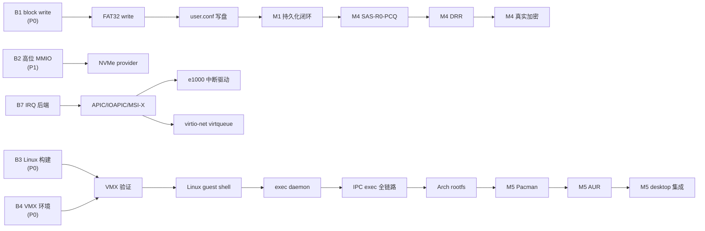

# Deshab 系统开发策划

> 本文档基于对 `docs/RE/`、`docs/上下文/`、`docs/` 顶层文档以及 `CLAUDE.md` / `project_memory` 的系统梳理，
> 给出文档现状盘点、实现差距识别、阻塞与风险登记，以及分阶段的开发路线策划。
> 它是 [ROADMAP.md](./ROADMAP.md) 的补充与更新——ROADMAP 描述内核侧 Phase 0–9 主线，本文档补上
> 兼容层、桌面、包管理等用户态/生态主线，并修正 ROADMAP 与实现态的偏差。

---

## 一、文档整理

### 1.1 文档地图

```text
docs/
├── ARCHITECTURE.md            系统架构总览（五大支柱 + 子系统现状 + 目录约定）
├── BOOT_SEQUENCE.md           五阶段启动模型（Ignis/Sigillum/Transitus/Origo/Excitas）
├── ROADMAP.md                 内核侧 Phase 0–9 路线图（部分状态滞后，见 §1.3）
├── 系统开发策划.md             ← 本文档
│
├── RE/                        研究与设计定稿（内核设计层）
│   ├── UTSM_设计架构.md        UTSM 架构定稿（段模型/UTRW/DRR/Checkpoint）
│   ├── UTSM_算法记录.md        UTSM 核心算法（段创建/密钥派生/Fast R-W/Slow Path/Checkpoint/Rollback）
│   ├── 驱动模块ABI设计.md      DKM ABI 定稿（driver_desc/kernel_api/ELF loader/manifest/状态机）
│   ├── Bug记录.txt             Bug 登记（当前仅 8 条，未按模板结构化）
│   ├── docs/                   desktop_architecture.md / tool_apps_design.md
│   └── test-cases/             8 份测试用例（boot-regression/driver-matrix/linux-compat/
│                               network-e2e/pe-compat/performance-baseline/userapps-matrix/x86emu32-coverage）
│
└── 上下文/                     开发对话记录（开发记录层，待提炼）
    ├── 系统策划与开发.md        前期 /plan 策划记录（cmd pe/peinfo 命令、/bin 目录、PE 样本）
    ├── 双内核架构与Linux内核交互.md   UTSM+Linux 双内核 Phase 1.1–1.3（VMX/EPT/IPC/9 hypercall）
    ├── Deshab Linux_EXE 兼容层开发.md  Phase 1.4+（park-resume/PE 兼容层/exec daemon/virtio-mmio）
    ├── 设计Winux-Kate桌面UI.md   desktop.elf 完整设计与优化（三页面/双缓冲/配色/FILES 过滤）
    ├── DeshabOS安装Pacman包管理器.md  Pacman 五阶段方案（WSL 互操作模式）
    └── Git Push to Remote.md    Git 推送操作记录
```

### 1.2 文档分类与角色

| 层级 | 目录 | 角色 | 状态 |
|------|------|------|------|
| **内核设计层** | `docs/RE/` | UTSM/DKM 的 v1 定稿设计，是实现的契约 | ✅ 定稿，与实现有少量偏差（见 §1.3） |
| **系统架构层** | `docs/` 顶层 | 架构总览、启动序列、路线图 | ⚠️ ROADMAP 滞后；ARCHITECTURE 有过时描述 |
| **开发记录层** | `docs/上下文/` | 开发过程的对话记录，含大量实现细节 | ⚠️ 对话格式，未提炼为正式设计文档 |
| **质量记录** | `docs/RE/Bug记录.txt` | Bug 登记 | ❌ 仅 8 条，未按既有模板结构化 |
| **测试用例** | `docs/RE/test-cases/` | 8 份测试覆盖说明 | 🔶 说明性文档，无自动化脚本关联 |

### 1.3 文档同步状态与差距

下表是 **文档描述 vs 当前实现** 的关键偏差，需在文档治理阶段修正：

| 文档 | 偏差描述 | 实际情况（据 CLAUDE.md / project_memory） |
|------|---------|------------------------------------------|
| `ROADMAP.md` §当前状态总览 | 网络标 "完整 RX/TX ring，无协议栈" | e1000 完整 RX/TX + **DHCP/ARP/UDP/DNS 协议栈已实现** |
| `ROADMAP.md` Phase 3 | "最小协议栈" 标 ⬜ | 协议栈已闭环（netman 配置 + DHCP） |
| `ROADMAP.md` 全文 | 未提及 Linux 兼容层 / PE 兼容层 / 桌面 / Pacman | 这些子系统已有大量实现/规划（见 docs/上下文/） |
| `ROADMAP.md` Phase 5 | firstInit.txt 标志写盘 ⬜ | `dsk_persist_userconf` 已能写 firstInit.txt（3 字节 `1\n`+dev_mode） |
| `ARCHITECTURE.md` §9.2 | 仍描述 "旋转加载动画（四色圆弧加载环）" | 已被 **静态 Logo** 取代（嵌入 Logo.png RGBA 居中绘制） |
| `ARCHITECTURE.md` §6 | console_fb "淡蓝背景 + 四色圆弧加载环" | 圆弧已移除，仅淡蓝背景 |
| `ARCHITECTURE.md` §10 开放设计点 4 | log API "当前实现为 `void (*info)(const char *msg)`" | 部分驱动已用 printf 变参，需统一 |
| `docs/RE/驱动模块ABI设计.md` §3 | kernel_api 全部 typed sub-struct 指针 | 实现为 `const void *` 占位 + Limine 字段直通 + block provider registry |
| `BOOT_SEQUENCE.md` B4 正常路径 | "仅 halt，待实现桌面/shell/登录" | 已实现：firstInit=1 时 DSK 加载 login.elf → desktop.elf（含 shell/cmd 双命令行 + 5 工具） |
| `Bug记录.txt` | 8 条纯文本，无编号/无状态/无修复提交 | 既有模板（BUG-YYYYMMDD-NNN）未被使用 |

### 1.4 文档之间的依赖关系

```text
ARCHITECTURE.md ──索引──→ RE/UTSM_设计架构.md ──细化──→ RE/UTSM_算法记录.md
       │                    │
       │                    └──索引──→ RE/驱动模块ABI设计.md
       │
       ├──索引──→ BOOT_SEQUENCE.md（B0–B4 实现态）
       └──索引──→ ROADMAP.md（Phase 0–9 设计态）

docs/上下文/双内核架构与Linux内核交互.md ──续──→ docs/上下文/Deshab Linux_EXE 兼容层开发.md
         │                                          │
         │                                          ├──→ docs/上下文/DeshabOS安装Pacman包管理器.md
         │                                          └──→ docs/上下文/设计Winux-Kate桌面UI.md
         │
         └──依赖──→ RE/UTSM_设计架构.md（VMM 运行在 UTSM Ring0）
```

**关键发现**：`docs/上下文/` 下的四份开发记录（双内核/Linux EXE/桌面 UI/Pacman）实际构成了与 ROADMAP 平行的 **用户态与生态主线**，但 ROADMAP 完全没有收录这条线。这是文档治理的首要任务。

---

## 二、实现盘点

### 2.1 子系统实现状态矩阵

| 子系统 | 状态 | 关键证据 | 主要缺口 |
|--------|------|---------|---------|
| **早期启动** (serial/IDT/PIC) | ✅ | IDT 0–47，PIC remap 0x20–0x2f | — |
| **DKM 驱动加载** (14 驱动) | ✅ | manifest.json 4-stage + 14 .drv ACTIVE | ABI 头未统一、warning 未清零 |
| **DMA 分配器** | ✅ | Limine USABLE → bitmap，低 4G 钳位 | — |
| **UTSM 封缄内存** | 🔶 | selftest 闭环，占位 XOR stream | 真实加密原语未选型 |
| **AHCI 块设备** | 🔶 | IDENTIFY/READ DMA + `ahci0` provider | **无 WRITE**、单扇区偶发超时 |
| **NVMe** | 🔶 | PCI discovery | BAR0 在 4G 以上，**待高位 MMIO** |
| **FAT32** | 🔶 | 只读 + 批量读 | **无 write**、子目录路径解析有限 |
| **e1000 网络** | ✅ | 完整 RX/TX + DHCP/ARP/UDP/DNS | 中断驱动收发（仍 polling） |
| **virtio_net** | 🔶 | PCI + capability 枚举 | 无 feature negotiation / virtqueue |
| **字体系统** | ✅ | DBF 16/24/32px，GB2312 全覆盖 | — |
| **FirstInit** | 🔶 | 中文 UI + 键盘 + SHA256 密码 | 鼠标光标、网络配置页、写盘闭环未全 |
| **正常启动路径** | ✅ | firstInit=1 → login.elf → desktop.elf | — |
| **desktop.elf** | ✅ | 三页面 + 窗口 + 任务栏 + 双命令行 + 5 工具 | fileman 触发 QEMU exit、脏矩形未做 |
| **shell.elf** | ✅ | linux/cp/mv/echo/ls/cat/rm + /bin 加载 | — |
| **cmd.elf** | ✅ | Windows 风格 + pe/peinfo + /bin PE 查找 | — |
| **Linux 兼容层代码** | 🔶 | VMM + linux_resume + IPC exec(16–20) + daemon + utsm_hcall | **Linux 内核未构建**、VMX 未验证 |
| **PE/EXE 兼容层** | ✅ | pe_service/loader/shim/x86emu32 + hello32/hello64 样本 | Win32 API 覆盖少 |
| **virtio-mmio 模拟** | 🔶 | blk/net 后端框架 + IRQ 注入(blk→5,net→6) | 未在真实 guest 验证 |
| **SAS-R0-PCQ 调度器** | ⬜ | 设计完成 | 未实现 |
| **DRR 恢复系统** | ⬜ | stub 占位 | 未实现 |
| **真实加密** | ⬜ | 64B line 接口预留 | 原语未选型 |
| **Pacman 包管理** | ⬜ | 五阶段方案设计 | 依赖 Linux guest 落地 |

### 2.2 关键能力清单（已对外暴露）

- **kernel_api**：log / rsdp / fb_* / boot_modules / irq_register / hhdm / dma.alloc_pages / block（read@+0xA8, write@+0x18）/ net
- **dsk_boot_context**：magic `0x44534B31424F4F54`（"DSK1BOOT"），reserved[4]=pe_service，reserved[5]=linux_compat_service
- **PE service**：load / run / unload（PE32+ 原生 Ring0，PE32 走 x86emu32）
- **Linux compat service**：exec(path, argv) → IPC EXEC_REQUEST(16) → daemon fork+exec → STDOUT(17)/STDERR(18)/EXIT(19)
- **IPC**：1MB 共享内存 @ GPA `0x04000000`，9 + 5 hypercall，VMCALL ABI = RAX `0x5554534D48430000|op`
- **FAT32**：`f32_read_root_file` / `f32_write_root_file`（写路径已用于 firstInit 持久化）

---

## 三、阻塞与风险

### 3.1 关键阻塞点

| # | 阻塞点 | 影响范围 | 严重度 | 缓解思路 |
|---|--------|---------|--------|---------|
| **B1** | **block write API 未实现**（AHCI WRITE DMA） | FAT32 write / user.conf 写盘 / FirstInit 完整闭环 / 桌面文件保存 | P0 | ROADMAP Phase 5 提前，先做 AHCI WRITE + FAT32 文件覆写 |
| **B2** | **高位 PCI MMIO 映射缺失**（4G 以上 BAR） | NVMe / 后续高位 DMA | P1 | ROADMAP Phase 0：页表映射接口 `mmio_map(phys, size, flags)` |
| **B3** | **WSL 构建阻塞**（gcc15 C23 vs Linux 6.6、ext4 I/O 错、网络） | Linux guest bzImage / initramfs / VMX 验证 / Pacman 全线 | P0 | `KCFLAGS='-std=gnu17'`；改用 Docker/真机 Linux 构建；预编译 bzImage 入仓 |
| **B4** | **QEMU TCG 不支持 VMX**，WHPX 与 OVMF 不兼容 | Linux 兼容层运行时验证 | P0 | 真机 VT-x / KVM 环境；或先用 KVM 加速 QEMU |
| **B5** | **fileman.elf 触发 QEMU exit** | 桌面文件管理器不可用 | P1 | 排查 boot context 字段访问（疑似 reserved 越界） |
| **B6** | **FirstInit 按键崩溃**（fb_text -O2 问题） | 首次启动体验 | P1 | fb_text 边界检查 + 编译优化降级 |
| **B7** | **IDT 仅 0–47**，无 vector allocator / APIC EOI | 中断驱动设备收发（e1000/virtio/MSI-X） | P2 | ROADMAP Phase 2，可与 B1/B2 并行 |

### 3.2 风险登记

| 风险 | 概率 | 影响 | 应对 |
|------|------|------|------|
| Linux 内核构建长期受阻，兼容层代码腐烂 | 高 | 高 | 设定 2 周窗口期，失败则冻结兼容层代码、主线转向调度器/DRR |
| ROADMAP 与实现态持续偏离，新成员误判状态 | 高 | 中 | 本次整理后立即同步 ROADMAP（见 §5） |
| `docs/上下文/` 对话记录膨胀，关键决策被淹没 | 高 | 中 | 提炼为正式设计文档（兼容层设计.md / 桌面设计.md） |
| UTSM 真实加密原语选型拖延，影响 DRR | 中 | 高 | Phase 9 前完成原语 PoC（HKDF + AES-CTR + Poly1305） |
| 单地址空间下 PE32+ 原生执行的安全风险 | 中 | 中 | PE shim 白名单 + IAT 拦截审计 |

---

## 四、开发策划

### 4.1 策划原则

1. **先闭环再扩展**——优先补齐已开工子系统的闭环（block write → FAT32 write → FirstInit 写盘 → 桌面稳定）。
2. **解阻塞优先于新功能**——B1/B3/B4 三个 P0 阻塞必须先突破。
3. **内核主线与生态主线并行**——ROADMAP Phase 0–9（内核）与 Pacman 五阶段（生态）不互相阻塞，可分人推进。
4. **不破坏 SAS-R0 / O(1) 热路径**——任何新功能不得在调度/UTRW fast path 引入扫描或重加密。
5. **文档与代码同步**——每个里程碑交付时同步更新 ROADMAP 与相关设计文档。

### 4.2 里程碑总览

```text
M1 持久化闭环 + 桌面稳定        ← 短期（2–4 周）
   └─ B1 block write → FAT32 write → FirstInit 写盘 → 桌面 bug 修复

M2 存储升级 + 中断后端          ← 中期（4–8 周）
   └─ B2 高位 MMIO → NVMe → B7 APIC/IOAPIC/MSI-X → e1000 中断驱动

M3 兼容层验证                   ← 中期（与 M2 并行，依赖 B3/B4 解锁）
   └─ Linux guest 构建 → VMX 验证 → virtio 后端 → Arch rootfs

M4 调度器 + 恢复 + 加密         ← 长期（8–16 周）
   └─ SAS-R0-PCQ → DRR → 真实加密

M5 软件生态                     ← 远期（依赖 M3）
   └─ Pacman → AUR → desktop Linux 命令集成
```

### 4.3 M1 — 持久化闭环 + 桌面稳定（短期）

**目标**：打通"用户设置 → 写盘 → 重启后正常启动"的完整闭环，并修复桌面已知 bug。

| 任务 | 依赖 | 验收标准 |
|------|------|---------|
| AHCI WRITE DMA 实现 | — | `dkm_block_api.write` 注册，LBA 写成功 |
| FAT32 文件覆写 / 创建 | AHCI WRITE | `f32_write_root_file` 可写 user.conf / firstInit.txt |
| FAT32 FAT 链分配 | FAT32 文件创建 | 新文件可创建、可追加 |
| FirstInit user.conf 写盘 | FAT32 write | 设置完成后 user.conf 落盘，重启后 login 可读取 |
| FirstInit 鼠标光标 | — | PS/2 IRQ12 + 包解码 + 24×24 光标移动（flip_rect 局部刷新） |
| FirstInit 网络配置页 | — | IP/DHCP/网关 UI + NETCONF.CNF 写盘 |
| 桌面 fileman.elf 崩溃修复（B5） | — | fileman 可正常打开、浏览、关闭 |
| FirstInit 按键崩溃修复（B6） | — | -O2 下 fb_text 稳定 |
| Bug记录.txt 结构化 | — | 8 条 bug 按 BUG-YYYYMMDD-NNN 模板补全 |

**里程碑标志**：首次启动设置 → 写盘 → 重启 → login → desktop 全链路稳定。

### 4.4 M2 — 存储升级 + 中断后端（中期）

**目标**：解锁 NVMe、迁移设备 IRQ 到 APIC/IOAPIC/MSI-X，为中断驱动收发打基础。

| 任务 | 依赖 | 验收标准 |
|------|------|---------|
| 页表映射接口 `mmio_map/unmap` | — | 通用接口可用 |
| 高位 PCI MMIO 映射（B2） | 页表映射 | NVMe BAR0 可读 register |
| 替换 arena 为真实页分配 | 页表映射 | 移除 16MB arena 上限 |
| NVMe admin queue / identify | 高位 MMIO | 注册 `nvme0` block provider |
| NVMe block provider（READ） | admin queue | LBA0 可读 |
| IDT 扩展到 256 vectors | — | vector allocator 可用 |
| APIC EOI 后端 | IDT 扩展 | 替代 PIC EOI |
| IOAPIC redirection | APIC EOI | 设备 IRQ 迁移到 IOAPIC |
| LAPIC timer | APIC EOI | 替代 PIT 调度时钟 |
| MSI / MSI-X | IOAPIC | NVMe/e1000 使用 MSI-X |
| e1000 中断驱动收发 | MSI-X | 替代 polling |
| virtio-net virtqueue RX/TX | 中断后端 | 收发包成功 |
| DKM 工程化收尾 | — | 统一 ABI 头、零 warning、QEMU 场景自动化 |

**里程碑标志**：NVMe 可读、网络中断驱动、DKM 工程化达标。

### 4.5 M3 — 兼容层验证（中期，与 M2 并行）

**目标**：突破 B3/B4 阻塞，让 Linux guest 真正跑起来，验证 park-and-resume + IPC exec 全链路。

| 任务 | 依赖 | 验收标准 |
|------|------|---------|
| Linux 6.6 LTS 构建（B3） | — | bzImage + initramfs 生成，limine.conf 启用模块 |
| VMX 运行环境（B4） | — | 真机 VT-x 或 KVM 加速 QEMU 可用 |
| VMX 自测通过 | B3+B4 | `vmm_self_test()` HLT 退出 OK |
| Linux guest 跑到 shell | VMX 自测 | initramfs busybox shell 可交互 |
| utsm_exec_daemon 运行 | Linux shell | EXEC_READY(20) 发送，park 生效 |
| virtio-blk 后端验证 | Linux shell | guest 内可读写块设备 |
| virtio-net 后端验证 | Linux shell | guest 内可 DHCP / ping |
| IPC exec 全链路 | daemon 运行 | shell `linux ls` → UTSM → daemon → stdout 回显 |
| Arch rootfs bootstrap | virtio 后端 | pacman 可用 |
| PE 兼容层扩展 | — | 更多 Win32 API（kernel32/user32 子集） |

**里程碑标志**：`linux ls` / `linux pacman -S hello` 在 Deshab shell 内可用。

### 4.6 M4 — 调度器 + 恢复 + 加密（长期）

**目标**：落地三大核心支柱，使 Deshab 从"可启动"升级为"可调度、可恢复、可加密"。

| 任务 | 依赖 | 验收标准 |
|------|------|---------|
| **SAS-R0-PCQ 调度器** | M2 页分配 | |
| ├─ TCB + task_create | — | 分配 TCB、process_uuid、stack/heap 段、cap table |
| ├─ Per-CPU runqueue | — | 每 CPU 独立 runqueue |
| ├─ O(1) 位图调度器 | runqueue | pick_next_task 为 O(1) |
| ├─ context_switch | 调度器 | utsm_switch_out/in 只加载 crypto 指针 |
| └─ task_kill crypto erase | context_switch | owned segment key_epoch++、state=DESTROYED |
| **DRR 恢复系统** | 调度器 | |
| ├─ Emergency Pool | — | 独立内存池，普通 allocator 不可用 |
| ├─ Watchdog | Emergency Pool | 独立于普通调度器 |
| ├─ Recovery log | Watchdog | WRITE_INTENT / WRITE_COMMIT 对 |
| ├─ Dirty Shard + Bitmap | — | 数据结构落地 |
| ├─ A/B Checkpoint 双槽 | Recovery log | CRC + 原子 active slot 切换 |
| ├─ 三级 Rollback | Checkpoint | Page / Segment / System |
| └─ 驱动 recovery ops | Rollback | quiesce/reset/reinit |
| **真实加密** | DRR root key | |
| ├─ 原语选型 PoC | — | HKDF + AES-CTR + Poly1305（`-mno-sse` 下可用） |
| ├─ KDF 实现 | 原语 | `segment_key = KDF(root_key, process_uuid, segment_uuid, key_epoch)` |
| ├─ Stream cipher | KDF | 64B cache line 加解密 |
| ├─ MAC | Stream cipher | 4KB page 粒度 MAC |
| └─ PCKC 真实 key schedule | MAC | 替换占位 |

**里程碑标志**：多任务调度 + checkpoint/rollback 演示 + UTSM 真实加密 selftest 通过。

### 4.7 M5 — 软件生态（远期，依赖 M3）

**目标**：Pacman + AUR + desktop 集成，形成可日常使用的软件生态。

| 任务 | 依赖 | 验收标准 |
|------|------|---------|
| FILE_TRANSFER hypercall | M3 | op 扩展，payload_pool 分块传输 |
| EXEC_FORWARD hypercall | M3 | shell 委托 Linux 执行 `/usr/bin/xxx` |
| shell path_search_and_run 扩展 | EXEC_FORWARD | PATH 命中 stub → IPC 委托 |
| pacman 装包验证 | Arch rootfs | `pacman -S <pkg>` 成功 |
| AUR helper（yay/paru） | pacman | AUR 包可装 |
| desktop 动态 Linux 命令图标 | EXEC_FORWARD | `app_descriptor.linux_cmd` 字段 |
| 网络包下载 | virtio-net 后端 | `pacman -Syu` 可更新 |

**里程碑标志**：在 Deshab 桌面点击图标运行 Linux 应用（如 firefox）。

### 4.8 依赖关系图



---

## 五、文档治理建议

### 5.1 立即修正（本次整理后）

1. **同步 ROADMAP.md**：
   - 网络协议栈状态 → ✅
   - 新增"用户态与生态主线"章节，收录桌面/Linux 兼容层/PE/Pacman
   - firstInit 写盘状态修正
   - Phase 5 部分任务标记为 🔶
2. **同步 ARCHITECTURE.md**：
   - §9.2 旋转加载环 → 静态 Logo
   - §6 console_fb 描述更新
   - §10 开放设计点更新 log API 状态
3. **结构化 Bug记录.txt**：8 条 bug 按既有 `BUG-YYYYMMDD-NNN` 模板补全（现象/复现/根因/修复/状态）。

### 5.2 中期提炼（下一个里程碑前）

| 来源（对话记录） | 目标正式文档 | 动作 |
|------------------|------------|------|
| `docs/上下文/双内核架构与Linux内核交互.md` + `Deshab Linux_EXE 兼容层开发.md` | `docs/兼容层设计.md` | 提炼架构图、内存布局、VMCS/VMEXIT、IPC 协议、PE 兼容层、daemon |
| `docs/上下文/设计Winux-Kate桌面UI.md` | `docs/桌面设计.md` | 提炼页面结构、配色、双缓冲、FILES 过滤、app_descriptor 机制 |
| `docs/上下文/DeshabOS安装Pacman包管理器.md` | 合并进 `docs/兼容层设计.md` §生态 | 提炼五阶段方案、WSL 互操作模式 |

### 5.3 长期机制

- **文档与代码同提交**：每个 PR 必须同步更新 ROADMAP 状态标记与相关设计文档。
- **测试用例脚本化**：`docs/RE/test-cases/` 8 份说明文档应关联到可执行脚本（QEMU 自动化场景）。
- **CLAUDE.md 季度回顾**：每季度校准 CLAUDE.md 与实际代码状态。

---

## 六、附录：关键技术参考速查

### 6.1 关键地址与魔数

| 项 | 值 | 说明 |
|----|-----|------|
| `dsk_boot_context.magic` | `0x44534B31424F4F54` | "DSK1BOOT" |
| `dkm_driver_desc.magic` | `0x444B4D31` | "DKM1" |
| VMCALL hypercall RAX | `0x5554534D48430000 \| op` | "UTSMHC\0\0" |
| IPC 共享内存 GPA | `0x04000000` | 1MB |
| Linux guest RAM GPA | `0x05000000+` | 64MB |
| Linux initrd GPA | `0x03000000` | 16MB+ |
| block_read 偏移 | `kernel_api + 0xA8` | read @ +0x10, write @ +0x18 |
| pe_service 槽 | `dsk_boot_context.reserved[4]` | |
| linux_compat_service 槽 | `dsk_boot_context.reserved[5]` | |
| IPC exec 消息号 | 16–20 | REQUEST/STDOUT/STDERR/EXIT/READY |
| `ipc_exec_request` 约束 | ≤240 字节 | 适配 IPC 单消息槽 |
| virtio-blk IRQ | 5（向量 `0x35`） | `0x30 + irq` |
| virtio-net IRQ | 6（向量 `0x36`） | `0x30 + irq` |

### 6.2 关键约束清单

- 进入 C 前 `cli/cld`；早期 serial 不无限等待 ready 位
- 未启用 FPU/SSE 前编译必须 `-mno-sse -mno-sse2 -mno-mmx -msoft-float`
- DATA/BSS 段使用 `PF_R|PF_W|PF_X`（SAS-R0 驱动内存需可执行）
- DSK ibuf 1MB；g_dsk_fat32_filedata 2MB；g_fdata 1MB
- FAT32 批量读 ≥8 扇区（推荐 256 扇区），避免单扇区 AHCI 不稳定
- DSK linker.ld 必须把 .bss 分离为 NOBITS（否则 deshab.elf 膨胀至 2.3MB）
- mkfat32.ps1 Name83 必须正好 11 字符（8+3）
- Linux guest cmdline 必须含 `nohlt idle=poll`
- VMCS 不保存 guest GPR，vmexit_asm.S 必须保存 16 个 GPR 到 `g_guest_regs`
- 调度热路径禁止扫描 capability / 计算 MAC / 写 checkpoint / 重加密
- DRR recovery 路径禁止依赖普通堆分配器
- PE32+ 用 `__attribute__((ms_abi))` shim；PE32 走 x86emu32 解释器

### 6.3 关键文件索引

| 模块 | 关键文件 |
|------|---------|
| UTSM 入口 | `CODE/UTSM/kernel/main.c` |
| DSK 加载 | `CODE/UTSM/kernel/dsk_loader.c` |
| boot context | `CODE/UTSM/include/utsm/dsk.h` |
| VMM | `CODE/UTSM/vmm/vmm.c` / `vmexit.c` / `linux_boot.c` / `linux_resume.c` / `vmexit_asm.S` |
| PE 兼容层 | `CODE/UTSM/pe/pe_service.c` / `pe_loader.c` / `pe_shim.c` / `x86emu32.c` |
| Linux compat | `CODE/UTSM/vmm/linux_compat.c` |
| IPC 协议 | `CODE/utsm-ipc/ipc_proto.h` |
| Linux 驱动 | `CODE/linux/patches/utsm_hcall.c` |
| exec daemon | `CODE/linux/initramfs/bin/utsm_exec_daemon.c` |
| DSK 主内核 | `CODE/dsk/main.c` |
| 桌面 | `CODE/desktop/main.c`（dt_load_elf @ L1390–1461） |
| shell | `CODE/shell/main.c`（path_search_and_run @ L1416–1460） |
| cmd | `CODE/cmd/main.c`（cmd_pe / cmd_peinfo） |
| DKM 驱动 | `CODE/DKM/<class>/<driver>.c` |
| FAT32 镜像构建 | `.build_tmp/mkfat32.ps1` |
| PE 样本生成 | `CODE/tools/pe-samples/gen_pe.py` |
| Linux 构建 | `CODE/linux/build.sh` |

---

## 七、下一步行动建议

按优先级排序的立即可执行动作：

1. **【文档】同步 ROADMAP.md 状态标记**（§5.1）——本次整理的直接产物，1 小时内可完成
2. **【文档】结构化 Bug记录.txt**（§5.1）——8 条 bug 补全模板字段
3. **【代码】启动 M1：AHCI WRITE DMA**（§4.3）——突破 B1 阻塞，是持久化闭环的起点
4. **【代码】修复 fileman.elf QEMU exit**（§4.3 B5）——恢复桌面文件管理器可用
5. **【环境】启动 Linux 内核构建尝试**（§4.5 B3）——兼容层验证的长周期任务，应尽早并行启动
6. **【文档】提炼 `docs/兼容层设计.md`**（§5.2）——把两份对话记录浓缩为正式设计文档

---

> 本文档随项目推进持续更新。每个里程碑完成时，更新 §2 实现状态矩阵与 §4 里程碑进度。
